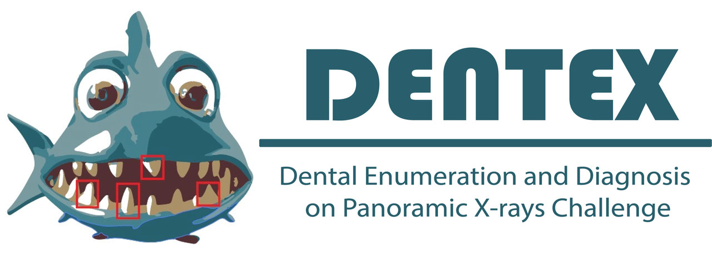

# DENTEX CHALLENGE 2023 #

<p float="left">
    
    
    
</p>

## Detection of abnormal teeth and associated diagnosis from panoramic x-rays ##

Panoramic X-rays are widely used in dental practice to provide a comprehensive view of the oral cavity and aid in treatment planning for various dental conditions. 
However, interpreting these images can be a time-consuming process that can distract clinicians from essential clinical activities. 
Moreover, misdiagnosis is a significant concern, as general practitioners may lack specialized training in radiology, and communication errors can occur due to work exhaustion.

## Background

https://dentex.grand-challenge.org/

The primary objective of this challenge is to develop algorithms that can accurately detect abnormal teeth with dental enumeration and associated diagnosis. 
This not only aids in accurate treatment planning but also helps practitioners carry out procedures with a low margin of error.

## Docker container to create a reproducible environment

The notebooks, modules and functions in this repository can be used with any virtual environment. 
However, I am including a Docker file so that the project code can be examined in a reproducible 
environment with python 3.10.11 and all dependencies installed.

To build the docker container and start a jupyter notebook, use the following commands:

```bash
docker compose build # Downloads the python image and builds the container with dependencies
docker compose up # Starts Jupyter Notebook server inside the container. Just click on the link.

```

#### Dependencies

This package requires dependencies. Rather than using a requirements.txt file, we
will use [pipenv](https://pipenv.readthedocs.io/en/latest/) to provide a pure, repeatable, application environment.

#### Installation

If you are using the Docker environment, you should be good to go.  Mac/windows
users should [install pipenv](https://pipenv.readthedocs.io/en/latest/#install-pipenv-today) into
their main python environment as instructed.  Unfortunately, using pipenv or
other virtual environments inside a conda environment is not  recommended.

```bash
pipenv install --dev
pipenv run python some_python_file
```

### Download links

Dentex data: https://zenodo.org/records/7812323#.ZDQE1uxBwUG (11GB training, 150MB validation)

