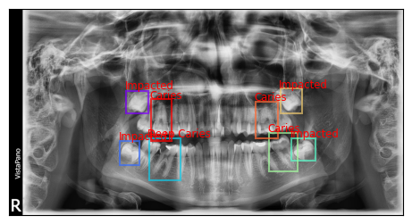
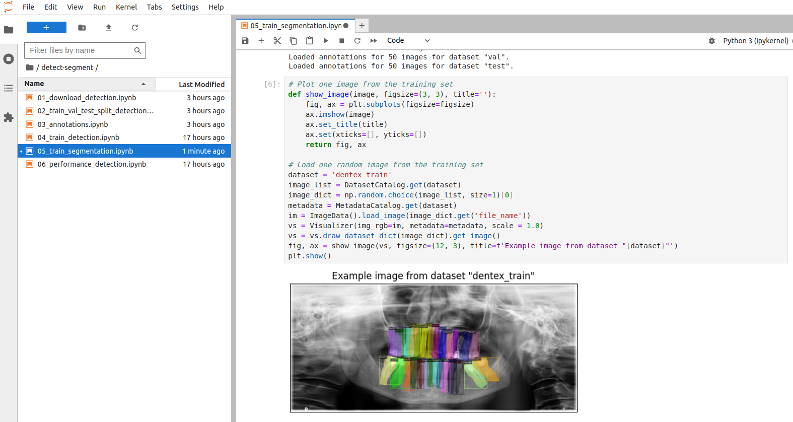
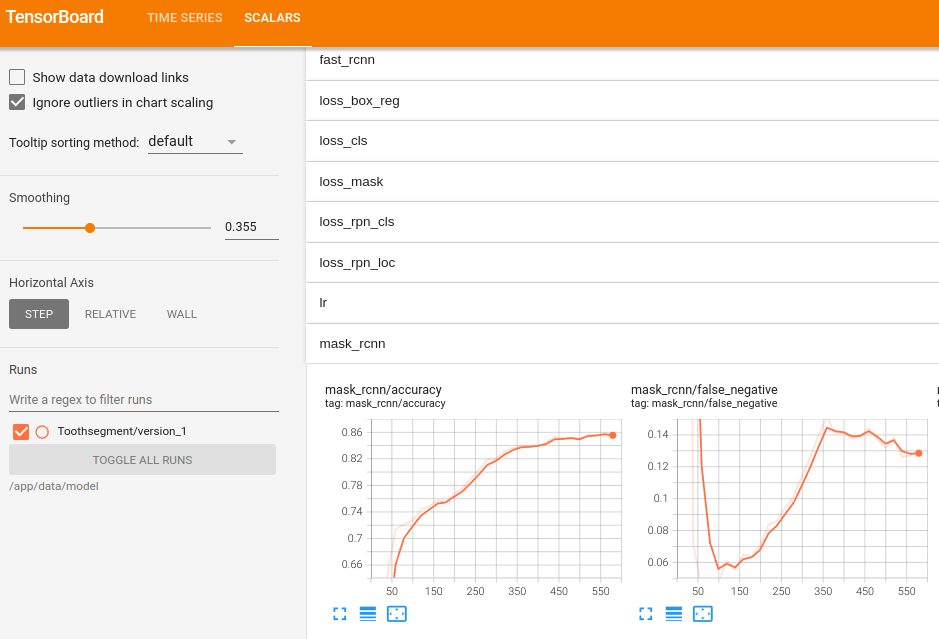
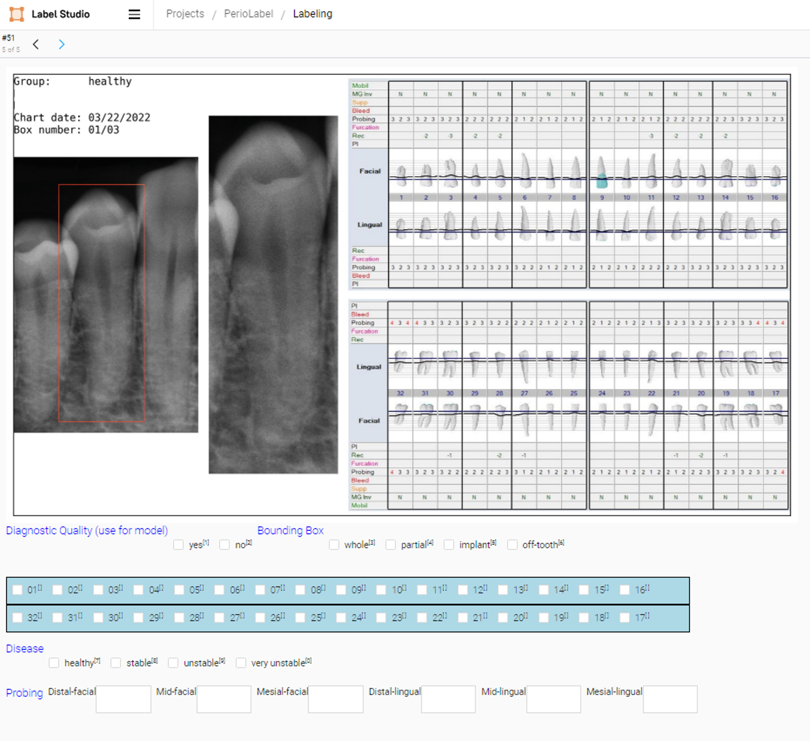

<p float="left">
    
    
</p>

## The CCB Computer Vision Code Repository #

This repository contains template code that that can be used as 
a starting point for computer vision projects. 
All frameworks, libraries and data sets are open source and publicly available.
Some common tasks included here are:

- [Image Classification](./notebooks/classification)
- [Object Detection](./notebooks/detect-segment)
- [Instance Segmentation](./notebooks/detect-segment)
- [Gradient-weighted Class Activation Mapping](./notebooks/classification/10_explainable_ai.ipynb)

## The Dentex Challenge 2023

The Dentex Challenge 2023 aims to provide insights into the effectiveness of AI in 
dental radiology analysis and its potential to improve dental practice by comparing 
frameworks that simultaneously point out abnormal teeth with dental enumeration and 
associated diagnosis on panoramic dental X-rays.
The dataset comprises panoramic dental X-rays obtained from three 
different institutions using standard clinical conditions but varying equipment and imaging protocols, 
resulting in diverse image quality reflecting heterogeneous clinical practice. 
It includes X-rays from patients aged 12 and above, 
randomly selected from the hospital's database to ensure patient privacy and confidentiality.
A detailed description of the data and the annotation protocol 
can be found on the [Dentex Challenge](https://dentex.grand-challenge.org/) website.
The data set is publicly available for download from the [Zenodo](https://zenodo.org/records/7812323#.ZDQE1uxBwUG) 
open-access data repository.

## Install locally with Docker
The most convenient way to get started with this repository is to run the 
code examples in a [Docker](https://docs.docker.com/) container.

The Dockerfile and docker-compose.yml files included in the repository can be 
used to create a Docker image and run a Docker container, which together provide a 
reproducible Python development environment for computer
vision experimentation. This environment includes Ubuntu 22.04, Python 3.10.12, PyTorch 2.2 and
Tensorflow 2.15 with NVIDIA CUDA 12.1, and a Jupyter Lab server, making it 
well-suited for training and evaluating custom models. 

<p float="left">
    
    
</p>

Here's a step-by-step guide on how to use this setup:

1. Install [Docker](https://docs.docker.com/) on your machine.
2. Clone the GitHub project repository to download the contents of the repository:
```bash
git clone git@github.com:ccb-hms/computervision.git
```
3. Navigate to the repository's directory: Use `cd computervision` to change your current directory to the repository's 
directory.
4. Build the Docker image. Use the command `docker compose build` to build a Docker image from the 
Dockerfile in the current directory. This image will include all the specifications from the Dockerfile, 
such as Ubuntu 22.04, Python 3.10.12, PyTorch 2.2 and TensorFlow 2.15 with CUDA, and a Jupyter Lab server.
5. Run `docker compose up` to start the Docker container based on the configurations 
in the docker-compose.yml file. This will also download a [TensorFlow 2](https://www.tensorflow.org/) image 
with the [TensorBoard](https://www.tensorflow.org/tensorboard) server for tracking and visualizing
important metrics such as loss and accuracy.
The default `docker-compose.yml`file expects a GPU accelerator and the NVIDIA Container Toolkit installed on the local machine.
Without a GPU, training of the neural networks in the example notebooks will be extremely slow. 
However, with the following command, the containers can be run without GPU support:
```bash
docker compose -f docker-compose-cpu.yml up
```
6. Access Jupyter Lab: Click on the link that starts with `localhost:8888` provided by the 
output of the last command.
7. Access TensorBoard: Open a web browser and go to localhost:6006 to access the TensorBoard server.
Real-time visualizations of important metrics will show up once model training is started.
8. Data sets and model checkpoints use a `./data` folder inside the root of the repository.
The location and the name of this directory are defined by the environmental variable `DATA_ROOT`.

### GPU support for Docker ###

The NVIDIA Container Toolkit is a set of tools designed to enable GPU-accelerated applications to run within Docker containers. 
This toolkit facilitates the integration of NVIDIA GPUs with container runtimes, 
allowing developers and data scientists to harness the power of GPU computing in containerized environments.
See the [NVIDIA Container Toolkit](https://docs.nvidia.com/datacenter/cloud-native/container-toolkit/latest/install-guide.html) page for installation instructions.

## Install without Docker ##

If you are using the Docker environment, you should be good to go.
For installation in a local environment we use 
[Pipenv](https://pipenv.readthedocs.io/en/latest/) to provide a pure, repeatable, application environment.
Mac/windows users should [install pipenv](https://pipenv.readthedocs.io/en/latest/#install-pipenv-today) into
their main python environment as instructed. 
Pipenv is a packaging tool for Python that solves some common problems 
associated with the typical workflow using pip, virtualenv, and the good old requirements.txt. 
It combines the functionalities of pip and virtualenv into one tool, 
providing a smooth and convenient workflow for developers.

With Pipenv, project dependencies and the virtual environment can be managed easily. 
It uses a Pipfile and Pipfile.lock to keep track of project dependencies with 
package versions, similar to how package.json works in Node.js projects or Gemfile in Ruby.

```bash
# Create a pipenv environment with all dependencies
pipenv install -e . --dev
# Run jupyter lab
pipenv run jupyter lab
```
The notebooks use an environment variable called `DATA_ROOT` to keep track of the data files.
For use with a docker container, this variable is defined in the Dockerfile
as `DATA_ROOT=/app/docker`. If you do not use docker, you can just set the `DATA_ROOT` variable yourself or run the
bash script in `computervision/bash_scripts/create_env`:
```bash
cd computervision/bash_scripts
chmod +x ./create_env
source ./create_env
```
This creates a `.env` file in the project directory which is then automatically read by pipenv when 
the jupyter lab server is started with:
```bash
pipenv run jupyter lab
```

### Install on O2 at Harvard Medical School ###
<h3></h3>

O2 is the linux-based high-performance computing platform at 
Harvard Medical School. The platform is managed by the Research Computing Group, part of [HMS IT](http://it.hms.harvard.edu/), and documented
on the [O2 documentation website](https://harvardmed.atlassian.net/wiki/spaces/O2/overview?homepageId=1586790623).
The cluster does not support Docker at this time, so we recommend creating a 
virtual environment using [Pipenv](https://pipenv.readthedocs.io/en/latest/) as above. Or, follow the instructions to get started with 
the computer vision repository and Jupyter Notebooks on O2 [here](./docs/O2_install.md).


Label Studio is an open-source data labeling tool for labeling, annotating, 
and exploring many different data types. 
Additionally, the tool includes a powerful machine learning interface that can be used for new model training, 
active learning, supervised learning, and many other training techniques.

1. Multi-type annotations: Label Studio supports multiple types of annotations, including labeling for audio, video, images, text, and time series data. These annotations can be used for tasks such as object detection, semantic segmentation, and text classification among others.
2. Customizable: The label interface can be customized using a configuration API.



3. Machine Learning backend: Label Studio allows integration with machine learning models. You can pre-label data using model predictions and then manually adjust the results.
4. Data Import and Export: Label Studio supports various data sources for import and export. You can import data from Amazon S3, Google Cloud Storage, or a local file system, and export it in popular formats like COCO, Pascal VOC, or YOLO.
5. Collaboration: It supports multiple users, making it suitable for collaborative projects.
6. Scalability: Label Studio can be deployed in any environment, be it on a local machine or in a distributed setting, making it a scalable solution.

### How to Use Label Studio

The tool is included in this repository as a [submodule](https://git-scm.com/book/en/v2/Git-Tools-Submodules).
When you clone the main project, by default the directory that contains the submodule is included,
but without the files. Those can be installed when needed:
```bash
# Clone the main project if not already done
git clone git@github.com:ccb-hms/computervision.git
# CD into the computervision/label-studio directory 
cd computervision/label-studio
# Download the latest version 
git submodule init
git submodule update
```
Label studio can be run as a server application in a docker container. The process is the same as
described above for the main repository.
```bash
# CD into the computervision/label-studio directory 
cd computervision/label-studio
# Create the Label Studio image 
docker compose build
# Run the Label Studio server
docker compose up
```
Once installed, open a web browser and go to localhost:8080 to access the Label Studio server.
For more detailed installation instructions, 
see the [installation instructions](https://labelstud.io/guide/install).