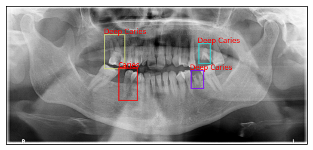

    

## The CCB Computer Vision Code Repository #

This repository contains template code that that can be used as 
a starting point for computer vision projects. 
All frameworks, libraries, and data sets are open source and publicly available.
Some common tasks included here are:

- [Image Classification](./notebooks/classification)
- [Object Detection](./notebooks/detection)
- [Segmentation]
- [Gradient-weighted Class Activation Mapping](./notebooks/classification/10_explainable_ai.ipynb)

## The Dentex Challenge 2023

The Dentex Challenge 2023 aims to provide insights into the effectiveness of AI in 
dental radiology analysis and its potential to improve dental practice by comparing 
frameworks that simultaneously point out abnormal teeth with dental enumeration and 
associated diagnosis on panoramic dental X-rays.
The dataset comprises panoramic dental X-rays obtained from three 
different institutions using standard clinical conditions but varying equipment and imaging protocols, 
resulting in diverse image quality reflecting heterogeneous clinical practice. 
It includes X-rays from patients aged 12 and above, 
randomly selected from the hospital's database to ensure patient privacy and confidentiality.
A detailed description of the data and the annotation protocol 
can be found on the [Dentex Challenge](https://dentex.grand-challenge.org/) website.
The data set is publicly available for download from the [Zenodo](https://zenodo.org/records/7812323#.ZDQE1uxBwUG) 
open-access data repository.

## Getting started with this repository ##
[Install on your local machine](./docs/local_install.md)

[Install on the HMS O2 cluster](./docs/O2_install.md)

## Label Studio ##

Label Studio is an open-source data labeling tool designed for labeling, annotating, and exploring various data types. The tool also features a robust machine learning interface, which can be utilized for training new models, active learning, supervised learning, and various other training techniques.

For more information on how to use Label Studio, please refer to the [Label Studio documentation](https://labelstud.io/guide/). You can find installation instructions [here](https://labelstud.io/guide/install.html) and in the documentation of this repository [here](./docs/label_studio.md).