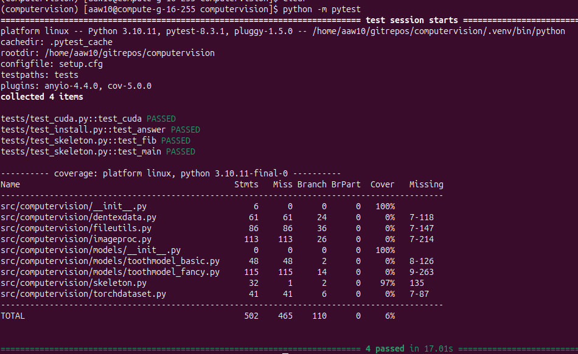

<p float="left">
    
</p>

## Installing the Computer Vision Repository on the O2 High-Performance Computing Cluster ##

## Python and CUDA Module Setup ##

1. Log in to the O2 cluster using your Harvard Medical School credentials combined with two-factor authentication. 
Follow the instructions provided on the [O2 WIKI page](https://harvardmed.atlassian.net/wiki/spaces/O2/pages/1601700123/How+to+login+to+O2). 
2. Request an interactive partition with GPU. Execute the commands below to
access a list of available GPU cards and submit an interactive GPU job using the *srun* command.
```bash
sinfo  --Format=nodehost,available,memory,statelong,gres:40 -p gpu
```
```bash
# Request an interactive partition (for a duration of three hours)
srun -n 1 --pty -t 3:00:00 -p gpu --gres=gpu:1 /bin/bash
```
3. Confirm your access to the GPU by using the *nvidia-smi* command.
```bash
nvidia-smi
```
The output will indicate the current NVIDIA driver version in the top left corner. 
To run CUDA 12.1.x, this version must be at least 525.60.13, 
as specified [NVIDIA CUDA Toolkit Release Notes](https://docs.nvidia.com/cuda/archive/12.2.1/cuda-toolkit-release-notes/index.html).

Please note that some older GPU servers may not have updated to the required GPU driver version and can 
fail the CUDA tests. However, this does not affect the installation process, 
as the test will succeed on a GPU with the required driver version.
If needed, request a specific GPU card, such as the Tesla M40, through this command:
```bash
srun -n 1 --pty -t 3:00:00 -p gpu --gres=gpu:teslaM40:1 /bin/bash
```
4. Load a module for the recommended Python version. 
You can obtain a list of available Python versions using the *module spider* command. 
Load Python 3.10.11 (recommended version for the computer vision repository) as follows:
```bash
# View all available Python versions:
module spider python

# View module load instructions for Python 3.10.11:
module spider python/3.10.11
````
```bash
# Load Python 3.10.11:
module load python/3.10.11
```
5. Load the CUDA 12.1 module:
```bash
# To view available CUDA versions, use:
module spider cuda

# To load both gcc 9.2.0 and CUDA 12.1, run:
module load gcc/9.2.0 && module load cuda/12.1

# To confirm CUDA library availability, run:
nvcc --version
```
## Setting up the pipenv virtual environment and dependencies ##
1. Install pipenv using pipx to create a virtual environment for the dependencies specified in the Pipfile. 
Ensure that the correct Python version is in use.
```bash
# To install pipx in your home directory, run:
pip install -U --user pipx
```
If the pipx command is not available, extend your PATH variable in the bash_profile to include the ~/.local/bin directory:
```bash
# Run pipx with --help flag
pipx --help

# If "command not found" error occurs, add $HOME/.local/bin to your PATH variable
echo 'export PATH="$HOME/.local/bin:$PATH"' >> ~/.bash_profile

# Activate the new profile setting
source ~/.bash_profile
```
2. Install pipenv in its own environment within your home directory.
```bash
# Install pipenv with pipx
pipx install pipenv
```
3. Clone the computer vision repository and install it and its dependencies into a pipenv virtual environment.
```bash
# Clone the computer vision repository
git clone git@github.com:ccb-hms/computervision.git
```
Directly install the python dependencies into the project folder.
```bash
# Clone the computer vision repository
git clone git@github.com:ccb-hms/computervision.git

# Navigate into the project repository
cd computervision

# Create a hidden .venv folder
mkdir .venv

# Install the package along with all dependencies
# Pipenv will use the .venv folder for the virtual environment
pipenv install --editable . --python=3.10.11 --dev
```
4. After installation, test the package and the new environment.
```bash
# Activate the python environment
pipenv shell
# Run the tests in the ./tests
python -m pytest
```
Upon successful installation and test run, the test session should complete without any errors.
The output after running the tests should look like this:

<p float="left">
    
</p>

## Running Jupyter Lab on the O2 portal ##

To run the Jupyter notebooks in the computervision/notebooks directory, 
we recommend creating a Jupyter lab session from 
the [O2portal](https://o2portal.rc.hms.harvard.edu/pun/sys/dashboard).

The tool can be directed to start a Jupyter Lab server using the python environment 
that you just created from above.


