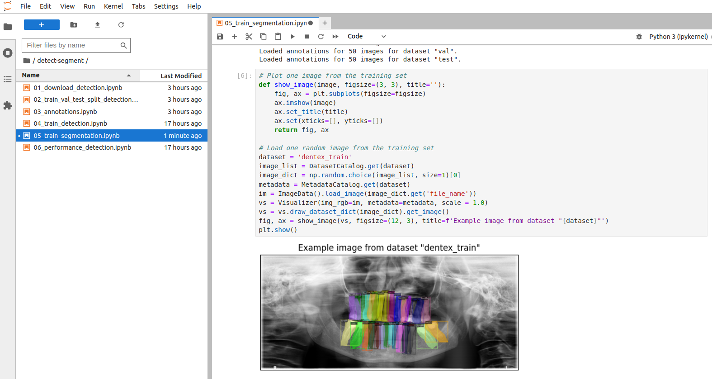
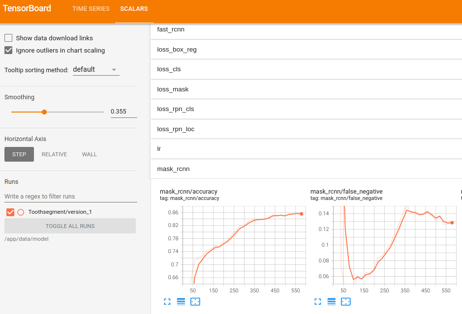

## Install locally with Docker ##

The most convenient way to get started with this repository is to run the
code examples in a [Docker](https://docs.docker.com/) container.

The `Dockerfile` and Compose files included in the repository build a reproducible Python
development environment for computer vision experimentation: Python 3.12 (via
[`uv`](https://docs.astral.sh/uv/)), PyTorch, Hugging Face `transformers`/`accelerate`,
Detectron2, and a Jupyter Lab server — well suited for training and evaluating custom models.
See [docker.md](./docker.md) for the full reference on all Compose files and scripts; this page
is a quick step-by-step.

<p float="left">
    
    
</p>

1. Install [Docker](https://docs.docker.com/) on your machine.
2. Clone the repository:
   ```bash
   git clone git@github.com:ccb-hms/computervision.git
   cd computervision
   ```
3. Create your local environment file and fill in real values (see
   [environment-variables.md](./environment-variables.md)):
   ```bash
   cp env .env
   ```
4. Start the container:
   ```bash
   ./compose-up.sh
   ```
   This pulls the published `ghcr.io/ccb-hms/computervision:latest` image and auto-detects
   whether to enable GPU support. To force one or the other:
   ```bash
   FORCE_GPU=1 ./compose-up.sh   # force GPU
   FORCE_GPU=0 ./compose-up.sh   # force CPU-only
   ```
   If you've changed the `Dockerfile` or dependencies and need a locally built image instead of
   the published one, use `docker-compose.build.yml` (see [docker.md](./docker.md)).
5. Access Jupyter Lab at `http://localhost:8888` (no login token/password is set — see the
   caveat in [docker.md](./docker.md)).
6. Access TensorBoard at `http://localhost:6006` once a training notebook has started logging.
7. Data sets and model checkpoints are stored under `./data` on the host, mounted into the
   container at `/app/data`. This location is controlled by the `DATA_DIR` environment variable.

### GPU support for Docker ###

The NVIDIA Container Toolkit enables GPU-accelerated containers. See the
[NVIDIA Container Toolkit installation guide](https://docs.nvidia.com/datacenter/cloud-native/container-toolkit/latest/install-guide.html)
for setup instructions. Without a GPU, training in the example notebooks will be extremely slow
but will still run — `compose-up.sh` falls back to CPU-only automatically if no NVIDIA runtime is
detected.

## Install without Docker ##

For a local (non-Docker) environment, this project uses
[`uv`](https://docs.astral.sh/uv/) for dependency management, matching the `Dockerfile`.

1. [Install `uv`](https://docs.astral.sh/uv/getting-started/installation/).
2. Clone the repository and install dependencies:
   ```bash
   git clone git@github.com:ccb-hms/computervision.git
   cd computervision
   uv sync --frozen
   ```
3. Detectron2 (used by the [segmentation pipeline](./segmentation.md)) is not part of
   `pyproject.toml` since it isn't published to PyPI — install it the same way the `Dockerfile`
   does:
   ```bash
   uv run python -m pip install --no-build-isolation "git+https://github.com/facebookresearch/detectron2.git"
   ```
4. Create your `.env` file and set `DATA_DIR` to wherever you want data/checkpoints to live
   locally (see [environment-variables.md](./environment-variables.md)):
   ```bash
   cp env .env
   ```
5. Start Jupyter Lab:
   ```bash
   uv run jupyter lab
   ```

For installation on a shared HPC system without Docker, see
[Install on the HMS O2 cluster](./install_O2.md).
