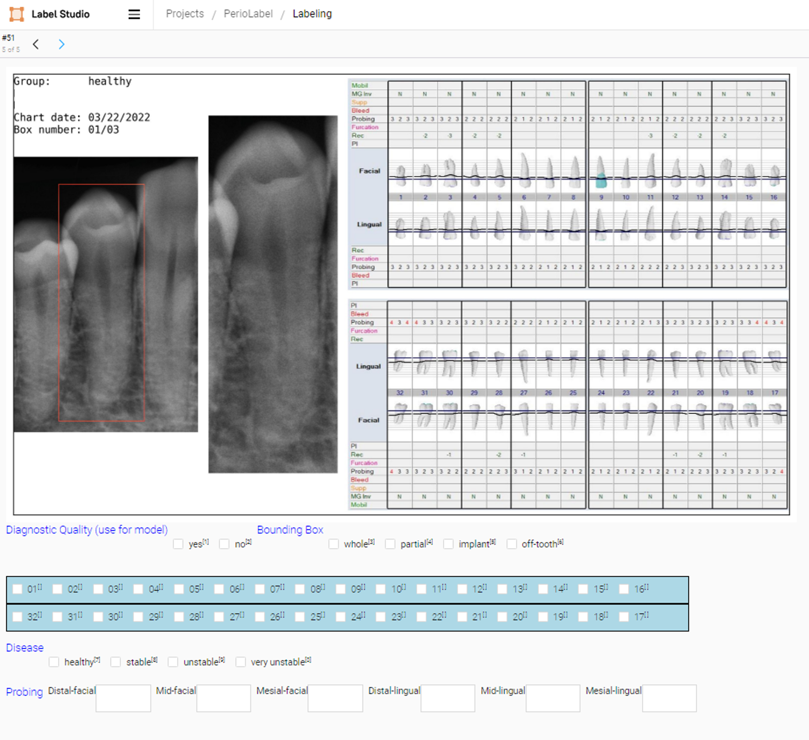

### Label Studio ###
Label Studio is a web-based tool for labeling data for machine learning and data science projects. Users can create and manage projects, label data, and export the results in a variety of formats. Important features of Label Studio include:

1. Multi-type annotations: Label Studio supports multiple types of annotations, including labeling for audio, video, images, text, and time series data. These annotations can be used for tasks such as object detection, semantic segmentation, and text classification among others.
2. Customizable: The label interface can be customized using a configuration API.



3. Machine Learning backend: Label Studio allows integration with machine learning models. You can pre-label data using model predictions and then manually adjust the results.
4. Data Import and Export: Label Studio supports various data sources for import and export. You can import data from Amazon S3, Google Cloud Storage, or a local file system, and export it in popular formats like COCO, Pascal VOC, or YOLO.
5. Collaboration: It supports multiple users, making it suitable for collaborative projects.
6. Scalability: Label Studio can be deployed in any environment, be it on a local machine or in a distributed setting, making it a scalable solution.

### How to Use Label Studio
The tool is included in this repository as a [submodule](https://git-scm.com/book/en/v2/Git-Tools-Submodules).
When you clone the main project, by default the directory that contains the submodule is included,
but without the files. Those can be installed when needed:
```bash
# Clone the main project if not already done
git clone git@github.com:ccb-hms/computervision.git
# CD into the computervision/label-studio directory 
cd computervision/label-studio
# Download the latest version 
git submodule init
git submodule update
```
Label studio can be run as a server application in a docker container. The process is the same as
described above for the main repository.
```bash
# CD into the computervision/label-studio directory 
cd computervision/label-studio
# Create the Label Studio image 
docker compose build
# Run the Label Studio server
docker compose up
```
Once installed, open a web browser and go to localhost:8080 to access the Label Studio server.
For more detailed installation instructions, 
see the [installation instructions](https://labelstud.io/guide/install).